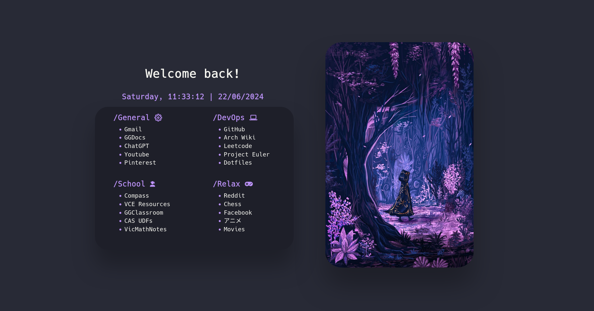

<div align="center">
    <h1>Startpage</h1>
</div>




<div align="left">
<h2>Usage</h2>

1. Clone this repository: `git clone https://github.com/TonyN678/TonyN678.github.io`.
2. Open the file `index.html` in your browser.
3. Customize the links and style as your will.

### Setting the startpage as the Home page <a name="homepage"></a>

1. Right click on the `index.html` from the startpage dir and open with firefox. 
2. Copy the location of the file from the address bar, should look like this: `file:///home/tien/GithubClonee/TonyN678.github.io/index.html`. 
3. Open `about:preferences#home` in the search bar, select custom URLs and paste the address like so:


4. Restart firefox.

### Setting the startpage as the New Tab page <a name="newtab"></a>

1. Open the 'TonyN678.github.io/newtab/' directory in your file manager. It contains `local-settings.js` and `mozilla.cfg`.
2. Open `mozilla.cfg` in any text editor. It looks like this:


- In line 7 paste the address of the `index.html`(see previous section) in the double quotes. Save and close the file.

3. Open your terminal and `cd` into 'newtab/' directory (location of `local-settings.js` and `mozilla.cfg`). 
4. Now run the following commands as root user:
```
sudo cp mozilla.cfg /usr/lib/firefox/
sudo cp local-settings.js /usr/lib/firefox/defaults/pref/
```
5. Restart firefox (Done!).

## Customization

You can personalize the startpage by editing the `index.html` file. Change the colors, and styles in the `style.css` to suit your needs.

# Credits

- Inspired from [Druxorey Startpage](https://github.com/druxorey/startpage).


